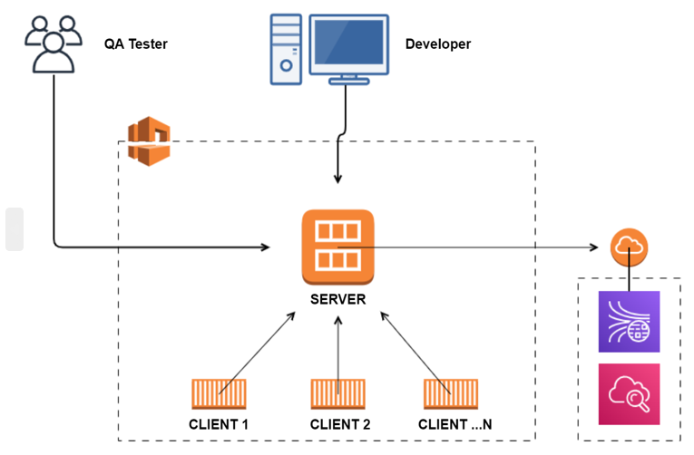

# O3DE Multiplayer Test Scaler

This Python CLI tool uses the [AWS CDK](https://docs.aws.amazon.com/cdk/v2/guide/home.html) to build, package and deploy [O3DE](https://github.com/o3de/o3de) multiplayer projects. It can be used to demonstrate O3DE multiplayer functionalities at scale (for example: 25 clients connecting to a server at stable FPS) and to create repeatable, large-scale tests.

It currently supports Windows clients and servers, but may be extended in the future to support additional platforms.

## How it works
When fully deployed, you will have a single game server running in Amazon EC2, with a configurable number of connected clients running in Amazon Elastic Container Service (ECS). It will also deploy an [AWS Metrics gem](https://www.o3de.org/docs/user-guide/gems/reference/aws/aws-metrics/) CDK project, if your project is configured to use one. See the _[Using the AWS Metrics gem](#using-the-aws-metrics-gem)_ section for more details.



## Using this project

### Before Starting

* Please note that the resources created by this tool incur cost. When you are done testing, please make sure to clean up all created AWS resources to avoid unnecessary charges. See the _[Clean up AWS Resources](#clean-up-aws-resources)_ section for more details.

### Prerequisites
You will need:
* An AWS account for deploying the required AWS resources
* An [EC2 Key pair](https://docs.aws.amazon.com/AWSEC2/latest/WindowsGuide/create-key-pairs.html) created in the AWS account and region in which you want to deploy
* The [AWS CLI](https://aws.amazon.com/cli/) installed and configured with valid AWS credentials. You will need near Admin-level permissions to deploy all the resources defined in this project.
* [Docker](https://docs.docker.com/desktop/windows/install/) installed and running in _Windows containers_ mode
* Python3 installed
* The [AWS CDK v2](https://docs.aws.amazon.com/cdk/v2/guide/home.html) installed and configured
* The source code for a working O3DE multiplayer project, such as [O3DE MultiplayerSample](https://github.com/o3de/o3de-multiplayersample)

### Create a Virtualenv
To manually create a virtualenv, from the root of this project run:

```$ python -m venv .venv```

After the init process completes and the virtualenv is created, use the following command to activate your virtualenv:

```bash
# in Windows command shell
$ .venv\Scripts\activate.bat

# in PowerShell
$ .venv\Scripts\Activate.ps1
```

Once the virtualenv is activated, run the following to install required dependencies:

```$ pip install -r requirements.txt```

### Generate and fill out a config file
Run `python main.py -f my-config.json` to generate a configuration file. This JSON file will be used to specify the O3DE project, engine, and other settings needed to build and deploy your project into AWS. 

Update the available configuration keys as required. A config file used to build and deploy the [O3DE MultiplayerSample project](https://github.com/o3de/o3de-multiplayersample) game from (local) source would look like this:

```json
{
  "build_installer_path": "install\\bin", // where in the game folder to place installer artifacts
  "build_monolithic": false,              // whether to build the game as "monolithic"
  "build_path": "build",                  // where in the game folder to place build artifacts
  "build_type": "release",                // the type of build to run
  "engine_path": "C:\\o3de",              // path on disc where the O3DE engine is located
  "output_path": "cdk\\assets",           // where in this project to place the packaged game
  "project_cache_path": "Cache",          // where in the game folder the asset cache is located
  "project_name": "MultiplayerSample",    // name of the game executable being built, also used to name AWS resources
  "project_path": "C:\\github\\o3de-multiplayersample",  // path on disc where the game is located
  "third_party_path": "C:\\Users\\MY_USER\\.o3de\\3rdParty", // path on disc to the O3DE engine 3rd party folder 
  "client_count": 1,                                     // number of game clients to deploy
  "server_private_ip": "10.0.0.4",                       // desired private IP address of the game server 
  "server_port": "33450",                                // game server port clients should connect to
  "aws_account_id": "123456789012",                      // AWS account to deploy to
  "aws_region": "us-east-1",                             // AWS region to deploy to
  "ec2_key_pair": "my-keypair",                          // name of the EC2 keypair to use in the configured AWS region
  "local_reference_machine_cidr": "<your-public-IP-address>/32", // (optional) CIDR group for allowed external connections
  "aws_metrics_cdk_path": "C:\\github\\o3de-multiplayersample\\Gem\\MetricsCDK",  // (optional) metrics project
  "aws_metrics_policy_export_name": "MULTIPLAYERSAMPLE-AWSMetrics:UserPolicy"     // (optional) metrics IAM policy
}
```

If you need to connect local reference machine(s) to the remote server, add 
the machine's external IPv4 CIDR (format like `0.0.0.0/32`) to the `"local_reference_machine_cidr"` key so proper access is set up during deployment.

#### Using the AWS Metrics gem
If your O3DE multiplayer project is using the [AWS Metrics gem](https://www.o3de.org/docs/user-guide/gems/reference/aws/aws-metrics/) for telemetry, this tool will deploy it during the [`build`](#build-and-package-the-multiplayer-project) step and export its resources to a [resource mapping file](https://www.o3de.org/docs/user-guide/gems/reference/aws/aws-core/resource-mapping-files/) which will be included in the deployed project package. To use this functionality, specify these two configuration keys:
* _"aws_metrics_cdk_path"_: the path on disc where the AWS Metrics gem CDK project is located
* _"aws_metrics_policy_export_name"_: the AWS CloudFormation export name of the IAM user policy needed to call the metrics service. This policy will be added to your test server's instance role to grant it permission to invoke the metrics REST API. See the [AWS Metrics gem docs](https://www.o3de.org/docs/user-guide/gems/reference/aws/aws-metrics/using/#cloudformation-stack-output) for more information.

Please note that the Amazon Kinesis SQL analytics application created by the AWS Metrics gem needs to be activated before it will start ingesting metrics. To ensure metrics collection is working as soon as your server is available, activate it prior to the [`deploy`](#deploy-the-remote-server-and-clients) step by navigating to the Amazon Kinesis console, finding the application named after your project under _Analytics applications / SQL applications_ and clicking `Run` at the top of the application page.

## Running Multiplayer Test Scaler
Open a command terminal in the root directory of this project for executing commands.

### Build and package the multiplayer project
Run `python main.py build --config-file [config_file_name] --platform [platform_name]` to create the multiplayer project package. 

This command will:
* If provided, deploy the AWSMetrics CDK application specified in `"aws_metrics_cdk_path"` and export its resources to an AWS resource mapping file
* Ensure the `launch_client.cfg` and `launch_server.cfg` files exist and configure them for connections on `"server_private_ip"` 
* Process assets of the multiplayer project
* Build the installer target of the multiplayer project
* Add outputs to the `{output_path}/{platform}` directory including:
  * Project package folder
  * Zipped project package (For creating an EC2 AMI)

#### Arguments
- _config-file_: Path to the config file to use. If no config file is specified, the tool will search for an existing config file called `multiplayer_test_scaler_config.json` under the execution directory.
- _platform_: Platform the project will be built for. Currently, only supports `Windows`.

### Create and/or specify an Amazon S3 bucket for exporting your test artifacts

When deployed, Multiplayer Test Scaler uses two Amazon S3 buckets to store logs and metrics files generated by the server:

1. A temporary "artifact" S3 bucket, defined by Multiplayer Test Scaler, where the contents of the `C:/o3de/user/log` and `C:/o3de/user/Metrics` directories on the server are synced every two minutes to ensure they are recoverable in case the server becomes unreachable during testing.
1. A user-defined "export" bucket, external to Multiplayer Test Scaler, where the contents of the temporary artifact bucket are uploaded when testing is complete and the server stack destroyed. By default, the code looks for an AWS CloudFormation stack output exported under the key **`O3deMetricsUploadBucket`** in the configured region, which is used as the upload destination. If such a bucket doesn't exist in the region where you are deploying, you can either create it or specify a different export name for Multiplayer Test Scaler to look up:
    * To create an S3 bucket with AWS Cloudformation and export its stack output, see the [AWS CloudFormation documentation](https://docs.aws.amazon.com/AWSCloudFormation/latest/UserGuide/using-cfn-stack-exports.html).
    * To use an existing exported S3 bucket in your account, modify the value of the `DEFAULT_DESTINATION_BUCKET_EXPORT_NAME` constant in [multiplayer_test_scaler/constants.py](cdk/multiplayer_test_scaler/constants.py) and [upload_test_artifacts.py](cdk/lambda/upload_test_artifacts/upload_test_artifacts.py).

### Deploy the remote server and clients
Run `python main.py deploy --target [target_name] --config-file [config_file_name] --platform [platform_name]` to set up:
* A VPC and security group for the remote server and clients to be deployed into
* EC2 image builder resources for baking an EC2 AMI
* An EC2 instance (based on the custom AMI) to host the multiplayer server
* An Amazon ECS service to run the multiplayer clients as containers

#### Arguments
- _config-file_: Path to the config file to use. If no config file is specified, the tool will search for an existing config file called `multiplayer_test_scaler_config.json` under the execution directory.
- _target_: (Optional) Target to deploy - client, server, all or AWSMetrics. The server and client targets will be deployed if no target is specified. Note that the AWSMetrics target is deployed during the `build` step so its resources can be configured in the packaged project. See the _[Using the AWS Metrics gem](#using-the-aws-metrics-gem)_ section for more details.
- _platform_: Platform of the project package. Currently, only supports `Windows`.


### Verify deployed client to server connection (manual)
To check the remote server log, go to the Amazon EC2 console and remote into the server instance following the [EC2 instructions](https://docs.aws.amazon.com/AWSEC2/latest/WindowsGuide/connecting_to_windows_instance.html).
Server log can be found under `C:\o3de\user\log\Server.log`.

To check the remote client logs, go to the Amazon ECS console and check logs for the client tasks. You can also view the CloudWatch log group directly by following the link to it on the task detail page.

### Connect local reference machine (manual)
Launch a local client following the [O3DE MultiplayerSample instructions](https://github.com/o3de/o3de-multiplayersample) and connect to the server via its public IP address, available in the server stack output (Check the [CDK application instructions](cdk/README.md) for more details).

### Clean up AWS resources
After you're done testing your multiplayer project, run `python main.py clear --target [target_name] --config-file [config_file_name] --platform [platform_name]` to destroy all AWS resources deployed by this project.

#### Arguments
- _config-file_: Path to the config file to use. If no config file is specified, the tool will search for an existing config file called `multiplayer_test_scaler_config.json` under the execution directory.
-  _target_: (Optional) Target to clear - client, server, all or AWSMetrics. If no target is specified, all AWS resources will be destroyed.
- _platform_: Platform of the project package. Currently, only supports `Windows`.

## Running unit tests

This project contains unit tests for both the python CLI tool and the included AWS CDK application. To run them:

1. If not already activated, activate the project's virtualenv by running `.venv\Scripts\activate.bat` in the root of the project
1. From within the root (for CLI tests) or `cdk` (for CDK application tests) directories, run `pip install -r requirements-dev.txt` to install the required test dependencies
1. From within the same directory, run the tests by executing `python -m pytest tests\unit`
